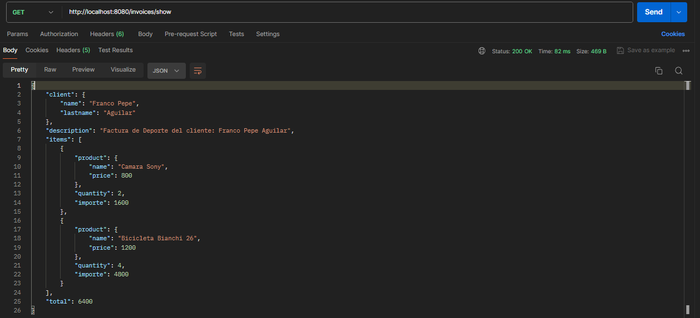
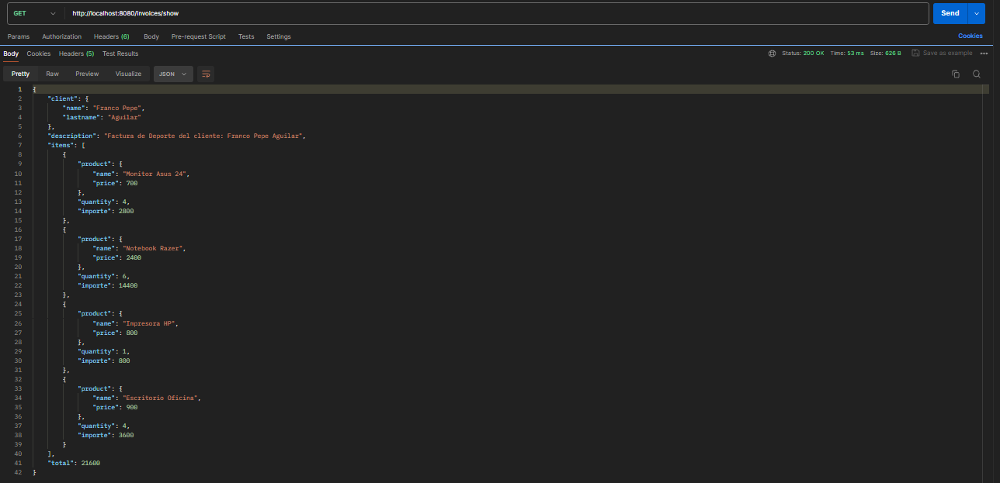

# Api-Factura-Inyeccion de Dependencias
## Descripción del proyecto

Este proyecto es un sistema de facturación básico que utiliza el framework Spring para demostrar la inyección de dependencias. Incluye entidades para representar facturas, servicios para la lógica de negocio y controladores para manejar las solicitudes HTTP.

## Características

- **Spring MVC**: Para la gestión de solicitudes y la lógica del controlador.
- **Inyeccion de Dependencias**: Permite a una clase, obtener desde el contenedor, una referencia de otro objeto.
- **Maven**: Para la gestión de dependencias.
- **Spring Boot**: Para facilitar la configuración y el despliegue de la aplicación.
- **Postman**: Facilita las peticiones HTTP, para crear APIs.


## Recursos
El proyecto esta creado con las siguientes tecnologías, las primeras 3 se obtienen
al momento de crear el proyecto.


| Plugin                |
|-----------------------|
| Spring Web            | 
| Spring Boot DevTools  | 
| Spring Boot Actuator  | 


## Estructura del proyecto

```
src/main/java/com/franco/curso/springboot/di/factura
    ├── SpringbootDiApplication.java
    ├── AppConfig.java
    ├── controllers/
    │   └── InvoiceController.java
    ├── models/
    │   └── Client.java
    │   └── Invoice.java
    │   └── Item.java
        └── Product.java
```

## Implementacion

### Models

```java
@Component
public class Client {
    
    @Value("${client.name}")
    private String name;
    
    @Value("${client.lastname}")
    private String lastname;

    public String getName() {
        return name;
    }
    public void setName(String name) {
        this.name = name;
    }
    public String getLastname() {
        return lastname;
    }

    public void setLastname(String lastname) {
        this.lastname = lastname;
    }
}
```

```java
@Component
public class Invoice {
    
    @Autowired
    private Client client;

    @Value("${invoice.description}")
    private String description;

    @Autowired
    @Qualifier("default")
    private List<Item> items;

    public Invoice() {
        System.out.println("Creando el componente de la factura");
        System.out.println(client);
        System.out.println(description);
    }

    @PostConstruct
    public void init() {
        System.out.println("Creando el componente de la factura");
        client.setName(client.getName().concat(" Pepe"));
        description = description.concat(" del cliente: ").concat(client.getName()).concat(" ")
                .concat(client.getLastname());
    }

    @PreDestroy
    public void destroy() {
        System.out.println("Destruyendo el componente o bean invoice!");
    }

    public Client getClient() {
        return client;
    }

    public void setClient(Client client) {
        this.client = client;
    }

    public String getDescription() {
        return description;
    }

    public void setDescription(String description) {
        this.description = description;
    }

    public List<Item> getItems() {
        return items;
    }

    public void setItems(List<Item> items) {
        this.items = items;
    }

    public int getTotal() {
        return items.stream()
                .map(item -> item.getImporte())
                .reduce(0, (sum, importe) -> sum + importe);
    }
}
```
```java
public class Item {
    
    private Product product;
    private Integer quantity;

    public Item() {
    }
    public Item(Product product, Integer quantity) {
        this.product = product;
        this.quantity = quantity;
    }
    public Product getProduct() {
        return product;
    }
    public void setProduct(Product product) {
        this.product = product;
    }
    public Integer getQuantity() {
        return quantity;
    }

    public void setQuantity(Integer quantity) {
        this.quantity = quantity;
    }
    
    public int getImporte() {
        return quantity * product.getPrice();
    }
}
```
```java
public class Product {
    
    private String name;

    private Integer price;

    public Product() {
    }
    public Product(String name, Integer price) {
        this.name = name;
        this.price = price;
    }
    public String getName() {
        return name;
    }
    public void setName(String name) {
        this.name = name;
    }
    public Integer getPrice() {
        return price;
    }
    public void setPrice(Integer price) {
        this.price = price;
    } 
}
```
### Controllers

```java
@RestController
@RequestMapping("/invoices")
public class InvoiceController {
    
    @Autowired
    private Invoice invoice;

    @GetMapping("/show")
    public Invoice show() {
        Invoice i = new Invoice();
        
        Client c = new Client();
        c.setLastname(invoice.getClient().getLastname());
        c.setName(invoice.getClient().getName());

        i.setClient(c);
        i.setDescription(invoice.getDescription());
        i.setItems(invoice.getItems());

        return i;
    }
}
```

### Pasando Datos

* Primero pasaremos los valores de `data.properties` a las clases mediante `@Value` en los atributos, desde `AppConfig.java`


* Anotamos los metodos de la clase `AppConfig.java` con `@Bean` para poder utilizarlo desde el contenedor de Spring.


```java
@Configuration
@PropertySource(value = "classpath:data.properties", encoding = "UTF-8")
public class AppConfig {
    
    // @Primary
    @Bean("default")
    List<Item> itemsInvoice() {
        Product p1 = new Product("Camara Sony", 800);
        Product p2 = new Product("Bicicleta Bianchi 26", 1200);
        return Arrays.asList(new Item(p1, 2), new Item(p2, 4));
    }
    
    @Bean
    List<Item> itemsInvoiceOffice() {
        Product p1 = new Product("Monitor Asus 24", 700);
        Product p2 = new Product("Notebook Razer", 2400);
        Product p3 = new Product("Impresora HP", 800);
        Product p4 = new Product("Escritorio Oficina", 900);
        return Arrays.asList(new Item(p1, 4), new Item(p2, 6), new Item(p3, 1), new Item(p4, 4));
    }
}
```

## Uso de Postman

**GET**
```sh
http://localhost:8080/invoices/show
```



* Cambiando de `@Bean` en `AppConfig.java`.



